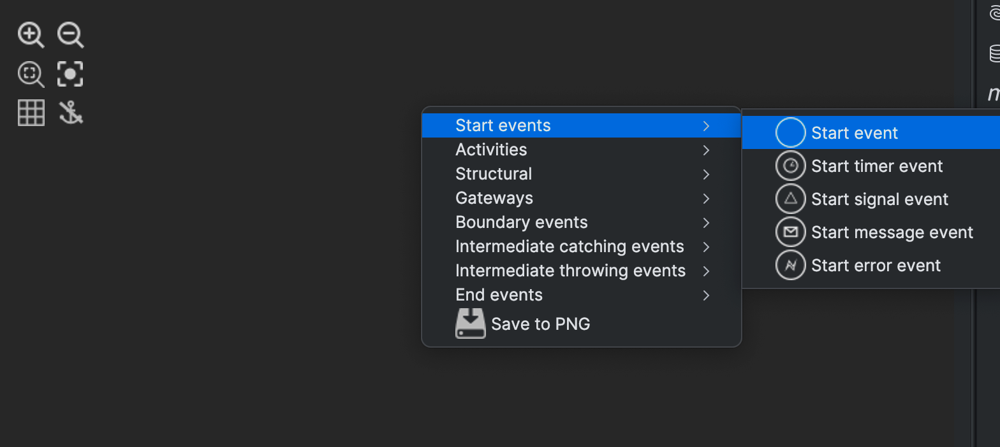

# Activiti 快速开始

Activiti 是一个开源的轻量级工作流和业务流程管理 （BPM） 平台，面向业务人员、开发人员和系统管理员。它的核心是一个 Java BPMN  流程引擎。Activiti 可在任何 Java 应用程序、服务器、集群或云中运行，可以与 Spring 完美集成。

> 官网： https://www.activiti.org/

## 1 使用Maven集成activiti

### 1.1 新建项目工程


### 1.2 配置Maven依赖

```xml
<properties>
  <project.build.sourceEncoding>UTF-8</project.build.sourceEncoding>
  <slf4j.version>1.6.6</slf4j.version>
  <log4j.version>1.2.12</log4j.version>
  <activiti.version>7.0.0.Beta1</activiti.version>
  <skipTest>true</skipTest>
</properties>

<dependencies>
  <dependency>
    <groupId>org.activiti</groupId>
    <artifactId>activiti-engine</artifactId>
    <version>${activiti.version}</version>
  </dependency>
  <dependency>
    <groupId>org.activiti</groupId>
    <artifactId>activiti-spring</artifactId>
    <version>${activiti.version}</version>
  </dependency>
  <!-- bpmn 模型处理 -->
  <dependency>
    <groupId>org.activiti</groupId>
    <artifactId>activiti-bpmn-model</artifactId>
    <version>${activiti.version}</version>
  </dependency>
  <!-- bpmn 转换 -->
  <dependency>
    <groupId>org.activiti</groupId>
    <artifactId>activiti-bpmn-converter</artifactId>
    <version>${activiti.version}</version>
  </dependency>
  <!-- bpmn json数据转换 -->
  <dependency>
    <groupId>org.activiti</groupId>
    <artifactId>activiti-json-converter</artifactId>
    <version>${activiti.version}</version>
  </dependency>
  <!-- bpmn 布局 -->
  <dependency>
    <groupId>org.activiti</groupId>
    <artifactId>activiti-bpmn-layout</artifactId>
    <version>${activiti.version}</version>
  </dependency>
  <!-- activiti 云支持 -->
  <dependency>
    <groupId>org.activiti.cloud</groupId>
    <artifactId>activiti-cloud-services-api</artifactId>
    <version>${activiti.version}</version>
  </dependency>
  <!-- mysql驱动 -->
  <dependency>
    <groupId>mysql</groupId>
    <artifactId>mysql-connector-java</artifactId>
    <version>8.0.29</version>
  </dependency>
  <!-- mybatis -->
  <dependency>
    <groupId>org.mybatis</groupId>
    <artifactId>mybatis</artifactId>
    <version>3.4.5</version>
  </dependency>
  <!-- 链接池 -->
  <dependency>
    <groupId>commons-dbcp</groupId>
    <artifactId>commons-dbcp</artifactId>
    <version>1.4</version>
  </dependency>
  <dependency>
    <groupId>junit</groupId>
    <artifactId>junit</artifactId>
    <version>4.12</version>
  </dependency>
  <!-- log start -->
  <dependency>
    <groupId>log4j</groupId>
    <artifactId>log4j</artifactId>
    <version>${log4j.version}</version>
  </dependency>
  <dependency>
    <groupId>org.slf4j</groupId>
    <artifactId>slf4j-api</artifactId>
    <version>${slf4j.version}</version>
  </dependency>
  <dependency>
    <groupId>org.slf4j</groupId>
    <artifactId>slf4j-log4j12</artifactId>
    <version>${slf4j.version}</version>
  </dependency>
</dependencies>
```

**添加log4j日志配置**(可选)

```properties
# Set root category priority to INFO and its only appender to CONSOLE.
#log4j.rootCategory=INFO, CONSOLE debug info warn error fatal
log4j.rootCategory=debug, CONSOLE, LOGFILE
# Set the enterprise logger category to FATAL and its only appender to CONSOLE.
log4j.logger.org.apache.axis.enterprise=FATAL, CONSOLE
# CONSOLE is set to be a ConsoleAppender using a PatternLayout.
log4j.appender.CONSOLE=org.apache.log4j.ConsoleAppender
log4j.appender.CONSOLE.layout=org.apache.log4j.PatternLayout
log4j.appender.CONSOLE.layout.ConversionPattern=%d{ISO8601} %-6r[%15.15t] %-5p %30.30c %x - %m\n
# LOGFILE is set to be a File appender using a PatternLayout.
log4j.appender.LOGFILE=org.apache.log4j.FileAppender
log4j.appender.LOGFILE.File=f:\act\activiti.log
log4j.appender.LOGFILE.Append=true
log4j.appender.LOGFILE.layout=org.apache.log4j.PatternLayout
log4j.appender.LOGFILE.layout.ConversionPattern=%d{ISO8601} %-6r[%15.15t] %-5p %30.30c %x - %m\n
```


### 1.3 配置activiti的引擎

在配置之前需要新建数据库，库名可改变（要在配置文件中指定数据库名称，URL及用户名密码）

```sql
CREATE DATABASE activiti DEFAULT CHARACTER SET utf8;
```

#### 方式一：单独配置activiti

在项目`resources`目录下新建文件为 `activity-cfg.xml` （注意：位置和文件名不可改变，activiti源码会读取这个文件）

```xml
<?xml version="1.0" encoding="UTF-8"?>
<beans xmlns="http://www.springframework.org/schema/beans"
       xmlns:xsi="http://www.w3.org/2001/XMLSchema-instance"
       xsi:schemaLocation="http://www.springframework.org/schema/beans
                    http://www.springframework.org/schema/beans/spring-beans.xsd">
    <!-- 链接池 dbcp-->
    <bean id="dataSource" class="org.apache.commons.dbcp.BasicDataSource">
        <property name="driverClassName" value="com.mysql.jdbc.Driver" />
        <property name="url" value="jdbc:mysql:///activiti" />
        <property name="username" value="root" />
        <property name="password" value="" />
        <property name="maxActive" value="3" />
        <property name="maxIdle" value="1" />
    </bean>
    <bean id="processEngineConfiguration" class="org.activiti.engine.impl.cfg.StandaloneProcessEngineConfiguration">
        <!-- 引用数据源 上面已经设置好了-->
        <property name="dataSource" ref="dataSource" />
        <!--activiti数据库表在生成时的策略  true - 如果数据库中已经存在相应的表，那么直接使用，如果不存在，那么会创建-->
        <property name="databaseSchemaUpdate" value="true"/>
    </bean>
</beans>
```

**生成数据库表结构**

运行下面程序段即可完成 activiti 表创建，可以通过改变 `activiti.cfg.xml` 中`databaseSchemaUpdate` 参数的值执行不同的数据表处理策略。

```java
import org.activiti.engine.ProcessEngine;
import org.activiti.engine.ProcessEngines;
import org.junit.Test;

public class GenerationActivitiScriptsTest {

    /**
     * 生成 activiti的数据库表
     */
    @Test
    public void testCreateDbTable() {
        //使用classpath下的activiti.cfg.xml中的配置创建processEngine
        ProcessEngine processEngine = ProcessEngines.getDefaultProcessEngine();
        System.out.println(processEngine);
    }
}
```


#### 方式二：使用spring配置activiti

这种方式就可以自定义文件名了，比如：`activity-spring.cfg.xml`(名称可任意修改)

```xml
<beans xmlns="http://www.springframework.org/schema/beans"
   xmlns:xsi="http://www.w3.org/2001/XMLSchema-instance" xmlns:mvc="http://www.springframework.org/schema/mvc"
xmlns:context="http://www.springframework.org/schema/context"
   xmlns:aop="http://www.springframework.org/schema/aop" xmlns:tx="http://www.springframework.org/schema/tx"
xsi:schemaLocation="http://www.springframework.org/schema/beans 
      http://www.springframework.org/schema/beans/spring-beans-3.1.xsd 
      http://www.springframework.org/schema/mvc 
      http://www.springframework.org/schema/mvc/spring-mvc-3.1.xsd 
      http://www.springframework.org/schema/context 
       http://www.springframework.org/schema/context/spring-context-3.1.xsd 
      http://www.springframework.org/schema/aop 
      http://www.springframework.org/schema/aop/spring-aop-3.1.xsd 
      http://www.springframework.org/schema/tx 
      http://www.springframework.org/schema/tx/spring-tx-3.1.xsd ">
   <!-- 工作流引擎配置bean -->
   <bean id="processEngineConfiguration" class="org.activiti.spring.SpringProcessEngineConfiguration">
      <!-- 数据源 -->
      <property name="dataSource" ref="dataSource" />
      <!-- 使用spring事务管理器 -->
      <property name="transactionManager" ref="transactionManager" />
      <!-- 数据库策略 -->
      <property name="databaseSchemaUpdate" value="drop-create" />
      <!-- activiti的定时任务关闭 -->
     <property name="jobExecutorActivate" value="false" />
   </bean>
   <!-- 流程引擎 -->
   <bean id="processEngine" class="org.activiti.spring.ProcessEngineFactoryBean">
      <property name="processEngineConfiguration" ref="processEngineConfiguration" />
   </bean>
   <!-- 资源服务service -->
   <bean id="repositoryService" factory-bean="processEngine" factory-method="getRepositoryService" />
   <!-- 流程运行service -->
   <bean id="runtimeService" factory-bean="processEngine" factory-method="getRuntimeService" />
   <!-- 任务管理service -->
   <bean id="taskService" factory-bean="processEngine"factory-method="getTaskService" />
   <!-- 历史管理service -->
   <bean id="historyService" factory-bean="processEngine" factory-method="getHistoryService" />
   <!-- 用户管理service 7.0版本已废弃该service-->
   <bean id="identityService" factory-bean="processEngine" factory-method="getIdentityService" />
   <!-- 引擎管理service -->
   <bean id="managementService" factory-bean="processEngine" factory-method="getManagementService" />
   <!-- 数据源 -->
   <bean id="dataSource" class="org.apache.commons.dbcp.BasicDataSource">
      <property name="driverClassName" value="com.mysql.jdbc.Driver" />
      <property name="url" value="jdbc:mysql://localhost:3306/activiti" />
      <property name="username" value="root" />
      <property name="password" value="" />
      <property name="maxActive" value="3" />
      <property name="maxIdle" value="1" />
   </bean>
   <!-- 事务管理器 -->
   <bean id="transactionManager"
    class="org.springframework.jdbc.datasource.DataSourceTransactionManager">
      <property name="dataSource" ref="dataSource" />
   </bean>
   <!-- 通知 -->
   <tx:advice id="txAdvice" transaction-manager="transactionManager">
      <tx:attributes></tx:attributes>
          <!-- 传播行为 -->
          <tx:method name="save*" propagation="REQUIRED" />
          <tx:method name="insert*" propagation="REQUIRED" />
          <tx:method name="delete*" propagation="REQUIRED" />
          <tx:method name="update*" propagation="REQUIRED" />
          <tx:method name="find*" propagation="SUPPORTS" read-only="true" />
          <tx:method name="get*" propagation="SUPPORTS" read-only="true" />
       </tx:attributes>
   </tx:advice>
   <!-- 切面，根据具体项目修改切点配置 -->
   <aop:config proxy-target-class="true">
      <aop:advisor advice-ref="txAdvice"  pointcut="execution(* com.example.service.impl.*.(..))"/>
  </aop:config>
</beans>
```

**生成数据库表结构**

```java
@Test
public void testCreateDbTable2(){
  //先构建ProcessEngineConfiguration，这里可指定配置文件地址
  ProcessEngineConfiguration configuration = ProcessEngineConfiguration.createProcessEngineConfigurationFromResource("activiti.cfg.xml");
  //通过ProcessEngineConfiguration创建ProcessEngine，此时会创建数据库
  ProcessEngine processEngine = configuration.buildProcessEngine();
  System.out.println(processEngine);
}
```


### 1.4 查看数据库表结构

**查看生成的表结构**

```bash
Type 'help;' or '\h' for help. Type '\c' to clear the current input statement.

mysql> use activiti
Reading table information for completion of table and column names
You can turn off this feature to get a quicker startup with -A

Database changed

mysql> show tables;
+-----------------------+
| Tables_in_activiti    |
+-----------------------+
| ACT_EVT_LOG           |
| ACT_GE_BYTEARRAY      |
| ACT_GE_PROPERTY       |
| ACT_HI_ACTINST        |
| ACT_HI_ATTACHMENT     |
| ACT_HI_COMMENT        |
| ACT_HI_DETAIL         |
| ACT_HI_IDENTITYLINK   |
| ACT_HI_PROCINST       |
| ACT_HI_TASKINST       |
| ACT_HI_VARINST        |
| ACT_PROCDEF_INFO      |
| ACT_RE_DEPLOYMENT     |
| ACT_RE_MODEL          |
| ACT_RE_PROCDEF        |
| ACT_RU_DEADLETTER_JOB |
| ACT_RU_EVENT_SUBSCR   |
| ACT_RU_EXECUTION      |
| ACT_RU_IDENTITYLINK   |
| ACT_RU_INTEGRATION    |
| ACT_RU_JOB            |
| ACT_RU_SUSPENDED_JOB  |
| ACT_RU_TASK           |
| ACT_RU_TIMER_JOB      |
| ACT_RU_VARIABLE       |
+-----------------------+
25 rows in set (0.00 sec)
```


看到刚才创建的表，我们发现Activiti 的表都以 `ACT_ `开头。

第二部分是表示表的用途的两个字母标识。用途也和服务的 API 对应。

-  `ACT_RE` ：’RE’表示 repository。这个前缀的表包含了流程定义和流程静态资源 （图片，规则，等等）。
-  `ACT_RU`：’RU’表示 runtime。这些运行时的表，包含流程实例，任务，变量，异步任务，等运行中的数据。Activiti 只在流程实例执行过程中保存这些数据， 在流程结束时就会删除这些记录。这样运行时表可以一直很小速度很快。
-  `ACT_HI`：’HI’表示 history。这些表包含历史数据，比如历史流程实例， 变量，任务等等。
-  `ACT_GE` ：GE 表示 general。通用数据， 用于不同场景下。

## 2 BPMN 插件安装与使用

这里推荐使用**Activiti BPMN visualizer**，它支持编辑和可视化Activiti BPMN图，并提供导航和流程调试支持。

### 2.1 安装

直接在idea插件市场搜索关键字安装即可。

> 插件地址：https://plugins.jetbrains.com/plugin/15222-activiti-bpmn-visualizer

### 2.2 实现一个简单的案例

我们来实现一个请假申请业务流程案例，流程如下：


#### 2.2.1 新建BPMN流程文件

在项目的`resources`目录下新建目录`bpmn`, 然后右键新建一个名为`leave.bpmn`BPMN的文件


> 新建后的文件名是以`.xml`后缀结尾的，我们可以重命名为 `.bpmn`

#### 2.2.2 显示画布

然后选中这个文件，右键显示画布`View BPMN Diagram`


#### 2.2.3 绘制流程

在画布上右键就可以弹出选项卡，可以选择不同的流程组件：



#### 2.2.4 编辑元信息

我们可以选中某个任务，然后编辑元信息


然后通过箭头指向完成案例的绘制，绘制好BPMN图会自动生成xml文件


最终编辑好的BPMN文件如下所示：

```xml
<?xml version="1.0" encoding="UTF-8"?>
<definitions xmlns="http://www.omg.org/spec/BPMN/20100524/MODEL" xmlns:xsi="http://www.w3.org/2001/XMLSchema-instance" xmlns:xsd="http://www.w3.org/2001/XMLSchema" xmlns:activiti="http://activiti.org/bpmn" xmlns:bpmndi="http://www.omg.org/spec/BPMN/20100524/DI" xmlns:omgdc="http://www.omg.org/spec/DD/20100524/DC" xmlns:omgdi="http://www.omg.org/spec/DD/20100524/DI" typeLanguage="http://www.w3.org/2001/XMLSchema" expressionLanguage="http://www.w3.org/1999/XPath" targetNamespace="http://www.activiti.org/processdef">
  <process id="myLeave" name="请假流程" isExecutable="true">
    <startEvent id="sid-08ca883c-d041-4ca3-8aa6-5ca20a053444" name="开始"/>
    <endEvent id="sid-a454e22a-852e-4cf6-95a0-b56a42210fe3" name="结束"/>
    <sequenceFlow id="sid-12235cd6-20af-4192-ac55-7de3b3c5f62c" sourceRef="sid-08ca883c-d041-4ca3-8aa6-5ca20a053444" targetRef="sid-775c062f-f855-4202-b9b1-4dc50b544a6b"/>
    <userTask id="sid-775c062f-f855-4202-b9b1-4dc50b544a6b" name="提交请假申请" activiti:assignee="worker"/>
    <userTask id="sid-aec10390-a305-4051-851e-7aae32c4690b" name="部门经理审批" activiti:assignee="manager"/>
    <sequenceFlow id="sid-e6223b1c-eb27-4873-9b39-3efef4291fcb" sourceRef="sid-775c062f-f855-4202-b9b1-4dc50b544a6b" targetRef="sid-aec10390-a305-4051-851e-7aae32c4690b"/>
    <userTask id="sid-48a2be85-06b0-49af-b2d4-9d5604b1f6c5" name="HR审批" activiti:assignee="hr"/>
    <sequenceFlow id="sid-4d812cfe-5183-4d74-9771-8ebd541e3c66" sourceRef="sid-aec10390-a305-4051-851e-7aae32c4690b" targetRef="sid-48a2be85-06b0-49af-b2d4-9d5604b1f6c5"/>
    <sequenceFlow id="sid-4d322d51-43df-440c-aed0-f8ae9f98b885" sourceRef="sid-48a2be85-06b0-49af-b2d4-9d5604b1f6c5" targetRef="sid-a454e22a-852e-4cf6-95a0-b56a42210fe3"/>
  </process>
  <bpmndi:BPMNDiagram id="BPMNDiagram_test">
    <bpmndi:BPMNPlane bpmnElement="myLeave" id="BPMNPlane_test">
      <!-- 这里省略了自动生成的画布内容>
    </bpmndi:BPMNPlane>
  </bpmndi:BPMNDiagram>
</definitions>
```

从上面可以看出我们的这个流程ID为：`myLeave`, 后面基于这个流程ID会做很多操作，比如：部署流程，启动实例，查询任务，完成任务等等。

#### 2.2.5 生成PNG文件

在画布空白处右键，可以保存为PNG文件，将保存后的文件复制到 `resources\bpmn` 目录下


好，这样我们的准备工作就做好了，接下来就可以部署activiti流程了。

## 3 让activiti运行起来

在activiti运行起来之前，我们来认识一下activiti核心的service服务接口。

### 3.1 activiti的核心service

| service名称           | 说明                                                         |
| --------------------- | ------------------------------------------------------------ |
| **RepositoryService** | 资源管理服务，用于管理流程定义和流程部署，提供对流程定义资源的访问（如 BPMN 文件、流程图等），提供流程的发布、挂起、激活功能。 |
| **RuntimeService**    | 用于启动和控制流程实例，提供查询流程实例和执行流程操作的方法，管理流程中的变量。 |
| **TaskService**       | 任务服务，用于任务管理，包括查询、分配和完成任务。提供任务的状态更新和与用户相关的操作。 |
| **HistoryService**    | 历史管理服务，提供历史数据查询功能，包括流程实例、任务、变量的历史记录。 |
| ManagerService        | activiti引擎管理服务，一般用于高级操作，例如查询数据库表信息、执行定制命令等。 |
| ~~IdentityService~~   | 管理用户和组的身份认证，在 Activiti 7 版本保留但不推荐使用，推荐在实际项目中使用外部身份服务来管理用户和组 |
| ~~FormService~~       | 处理流程和任务的表单数据，在 Activiti 7 中被弱化甚至移除，因为它的原始实现在很多场景下并不灵活，也没有完全满足现代动态表单的需求。 |
| DynamicBpmnService    | 用于动态修改 BPMN 模型，支持运行时更改流程行为。Activiti 6新增 |

这些service都可以通过`org.activiti.engine.ProcessEngine` 来获取


### 3.2 部署流程

**方式一：通过上传文件方式来部署一个流程**

```java
@Test
public void testDeployment(){
    // 1. 获取引擎
    ProcessEngine processEngine = ProcessEngines.getDefaultProcessEngine();
    processEngine.get
    // 2. 得到 processEngine 实例
    RepositoryService repositoryService = processEngine.getRepositoryService();
    // 3. 创建
    Deployment deployment = repositoryService.createDeployment()
            .addClasspathResource("bpmn/leave.bpmn")// 指定流程配置文件
            .addClasspathResource("bpmn/leave.png")// 指定流程图文件
            .name("请假申请流程")// 命名
            .deploy();// 部署
    System.out.println("deptId=" + deployment.getId());
    System.out.println("deptName=" + deployment.getName());
}
```

**方式二：通过上传zip文件方式来部署一个流程 (适合多个流程一起发布)**

```java
@Test
public void testDeploymentByZip(){
  // 1. 获取引擎
  ProcessEngine processEngine = ProcessEngines.getDefaultProcessEngine();
  // 2. 得到 processEngine 实例
  RepositoryService repositoryService = processEngine.getRepositoryService();

  // 获取zip输入流
  // 注意: 因为zip方式可以将多组流程一起发布
  // leave.zip 中的 .bpmn 文件与 .png 文件关系是通过 <process id="myLeave"> 中的ID来绑定关系的
  // 需要将png文件名规范命名, <通过文件名.processId.后缀名来命名>
  // 比如：leave.bpmn 与 leave.myLeave.png 这样就可以通过 processId 关联起来了
  InputStream inputStream = this.getClass().getClassLoader().getResourceAsStream("bpmn/leave.zip");
  ZipInputStream zipInputStream = null;
  if (inputStream != null) {
    zipInputStream = new ZipInputStream(inputStream);
  }

  // 3. 创建
  Deployment deployment = repositoryService.createDeployment()
    .addZipInputStream(zipInputStream)
    .name("请假申请流程")// 命名
    .deploy();// 部署
  System.out.println("deptId=" + deployment.getId());
  System.out.println("deptName=" + deployment.getName());
}
```

### 3.3 启动流程实例

```java
@Test
public void testStartProcess(){
  // 1. 获取引擎
  ProcessEngine processEngine = ProcessEngines.getDefaultProcessEngine();
  // 2. 得到 RuntimeService 实例
  RuntimeService runtimeService = processEngine.getRuntimeService();
  // 3. 启动实例
  ProcessInstance processInstance = runtimeService.startProcessInstanceByKey("myLeave");
  System.out.println("流程ID=" + processInstance.getId());
  System.out.println("流程定义ID=" + processInstance.getProcessDefinitionId());
  System.out.println("当前活动ID=" + processInstance.getActivityId());
}
```

### 3.4 查询任务列表

流程实例启动后, 需要执行任务, 执行前需要查询列表

```java
@Test
public void testFindTasks(){
  ProcessEngine processEngine = ProcessEngines.getDefaultProcessEngine();
  TaskService taskService = processEngine.getTaskService();

  // 查询任务列表
  List<Task> tasks = taskService.createTaskQuery()
    .processDefinitionKey("myLeave")
    .taskAssignee("manager")// worker --> manager --> hr
    .list();
  for (Task task : tasks) {
    System.out.println("流程实例ID: " + task.getProcessInstanceId());
    System.out.println("任务ID: " + task.getId());
    System.out.println("任务名称: " + task.getName());
    System.out.println("任务负责人: " + task.getAssignee());
  }
}
```

### 3.5 执行任务

```java
@Test
public void testCompleteTask(){
  ProcessEngine processEngine = ProcessEngines.getDefaultProcessEngine();
  TaskService taskService = processEngine.getTaskService();

  // 查询任务
  Task task1 = taskService.createTaskQuery()
    .processDefinitionKey("myLeave")// 流程key
    .taskAssignee("worker")// 负责人
    .singleResult();// 只返回一个任务(注意: 如果这个负责人有多个任务,这里查一个的话会抛异常)

  // 完成任务
  taskService.complete(task1.getId());
}
```

### 3.6 删除流程

```java
@Test
public void testDeleteDeployment(){
  ProcessEngine processEngine = ProcessEngines.getDefaultProcessEngine();
  RepositoryService repositoryService = processEngine.getRepositoryService();
  // 删除, 参数为ID, 若流程还未执行完, 调用删除会报错
  repositoryService.deleteDeployment("2501");
  /*
         若希望强制删除流程, 请使用下面的方式, 指定为true 不管流程是否完成, 都会删除整个流程实例.
         并且这个功能还会把这个流程的相关历史表的记录都会删掉, 一般此功能仅开放给管理员使用.*/
  //repositoryService.deleteDeployment("1", true);

}
```

### 3.7 查询历史操作记录

```java
@Test
public void testQueryHis(){
  ProcessEngine processEngine = ProcessEngines.getDefaultProcessEngine();
  HistoryService historyService = processEngine.getHistoryService();

  //根据 InstanceId 查询ACT_HI_ACTINST表的操作历史记录
  HistoricActivityInstanceQuery historicActivityInstanceQuery = historyService.createHistoricActivityInstanceQuery();
  historicActivityInstanceQuery.processInstanceId("5001");
  historicActivityInstanceQuery.orderByHistoricActivityInstanceStartTime().asc();
  List<HistoricActivityInstance> list = historicActivityInstanceQuery.list();
  for (HistoricActivityInstance hi : list) {
    System.out.println(hi.getActivityId());
    System.out.println(hi.getActivityName());
    System.out.println(hi.getProcessDefinitionId());
    System.out.println(hi.getProcessInstanceId());
    System.out.println("<==========================>");
  }
}
```

